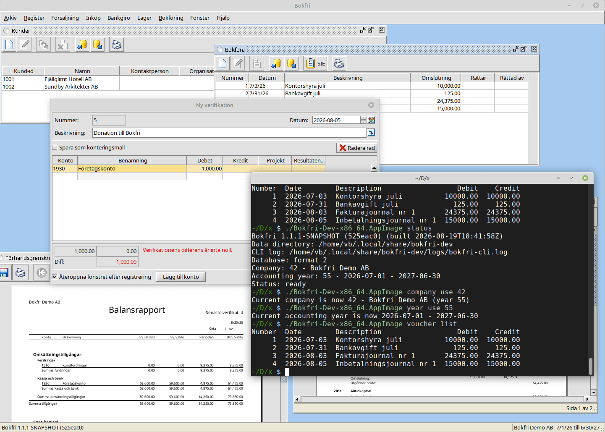

<p align="center">
  <a href="https://bokfri.viblo.se/">
    
  </a>
</p>

# Bokfri

Bokfri är ett fritt och kostnadsfritt bokföringsprogram för svenska föreningar
och småföretag, med både grafiskt desktopgränssnitt och kommandorad för
automatisering. Programmet installeras på din egen dator: det kräver inget
abonnemang eller konto och bokföringsdata lagras inte i någon molntjänst.

**[Webbplats](https://bokfri.viblo.se/) ·
[Ladda ner](https://bokfri.viblo.se/download/) ·
[Användarhjälp](https://bokfri.viblo.se/help/) ·
[Rapportera problem](https://github.com/vibloteket/bokfri/issues)**

Bokfri bygger vidare på Fribok och JFS Accounting, som har använts i över 20 år, 
men har en egen identitet och versionshistorik med start vid Bokfri 1.0.

> [!NOTE]
> Summary in English in the end of the README.



## Funktioner

- grafiskt desktopgränssnitt och CLI för manuellt arbete, rapporter och automatisering
- verifikationer, bokföringsår och automatkonteringar
- sex medföljande BAS 2026-kontoplaner för olika företags- och föreningsformer
- import och export av SIE-filer samt import av BGMax
- fakturor, kreditfakturor, offerter och order
- kund-, leverantörs- och artikelregister
- resultat- och balansrapporter, huvudbok och momsredovisning
- import och export av bland annat kontoplaner, kunder och artiklar
- lokal säkerhetskopiering och återställning

Bokfri är anpassat för svenska förhållanden. Andra språk i gränssnittet innebär
inte att programmet är anpassat till andra länders bokförings- eller
skatteregler.

## Ladda ner

Färdiga paket byggs för:

- **Windows** – MSI
- **macOS** – DMG
- **Linux** – AppImage

Den senaste publicerade versionen finns på
[bokfri.viblo.se/download](https://bokfri.viblo.se/download/) och under
[GitHub Releases](https://github.com/vibloteket/bokfri/releases).

## Kommandoradsgränssnitt

Bokfri innehåller ett engelskspråkigt, headless kommandoradsgränssnitt för
rapporter, automatisering, datautbyte och reproducerbara bokföringsflöden.
Kommandon, hjälptexter och standardutdata är på engelska; bokföringsdata och
svenska begrepp i registren behåller naturligtvis sitt innehåll. Windows-
installationen gör kommandot `bokfri` tillgängligt i nya terminalfönster;
utvecklingspaketet använder `bokfri-dev`. På macOS finns launchern i
app-paketet och på Linux kan AppImage-filen ta emot CLI-argument direkt.

`--format json` ger maskinläsbar utdata. CLI:t delar aktuellt företag och
bokföringsår med det grafiska gränssnittet. Valen kan därför göras i valfritt
gränssnitt:

```sh
bokfri company list
bokfri company use 37
bokfri year list
bokfri year use 12
bokfri trial-balance --format json
```

För skript kan `--company-id`, `--year-id` och `--data-dir` användas som
tillfälliga alternativ utan att ändra de sparade valen. Alla kommandon som tar
Bokfri-JSON kan skriva sitt code-first JSON Schema, exempelvis med
`bokfri voucher schema`. Databasformatet kan
kontrolleras med `bokfri database status`; en äldre databas migreras separat
med `bokfri database migrate`, som först skapar och verifierar en full backup.

Skrivande arbetsflöden kan normalt valideras eller förhandsgranskas med
`validate`, `--dry-run` eller genom att utelämna `--commit`. Läs den
[fullständiga CLI-guiden](https://bokfri.viblo.se/help/cli/) för installation,
företags- och årsval, rapporter, JSON-format, fakturor, betalningar, backup, SIE och
felsökning. Den exakta syntaxen för den installerade versionen visas med
`bokfri --help` och `bokfri KOMMANDO --help`.

## Hjälp, support och kontakt

- [Användarhjälp](https://bokfri.viblo.se/help/)
- [Rapportera ett problem eller föreslå en förbättring](https://github.com/vibloteket/bokfri/issues)
- Kontakt: [vb@viblo.se](mailto:vb@viblo.se)

Beskriv operativsystem, Bokfri-version och stegen för att återskapa problemet i
en felrapport. Utvecklingsbyggen visar även Git-commit i versionsinformationen.
Publicera aldrig bokföringsdata, personuppgifter eller andra känsliga uppgifter i
en öppen felrapport.

## Bygga från källkod

### Krav

- JDK 21 eller senare
- Apache Maven 3.6.3 eller senare

### Bygg och testa

```sh
mvn clean install
```

Det skapar bland annat den körbara allt-i-ett-JAR-filen i `target/`.
JAR-filens exakta namn följer versionen i `pom.xml`. Ett deterministiskt
PDF-galleri för rapportregressioner kan genereras och jämföras med:

```sh
./scripts/pdf-gallery generate
./scripts/pdf-gallery compare
```

Galleriet hamnar i `target/pdf-gallery/`; `index.html` visar de renderade
sidorna. En avsiktlig visuell förändring kan godkännas med
`./scripts/pdf-gallery approve`, men det kommandot körs aldrig av CI.

Rapportmallarnas enda källträd är `src/main/resources/reports/report/`.
Se [rapportmallarnas beroendekarta](docs/report-templates.md) för hur Java-printers
kopplas till JRXML-filer och hur kartan uppdateras. Fontkällor, licenser och inbäddning dokumenteras i
[rapportfonter](docs/report-fonts.md).

Den aktuella versionen kan köras från projektroten med:

```sh
java -jar target/bokfri-1.1.2-SNAPSHOT-jar-with-dependencies.jar
```

Samma JAR kan starta kommandoradsgränssnittet genom att ett CLI-argument anges:

```sh
java -jar target/bokfri-1.1.2-SNAPSHOT-jar-with-dependencies.jar version
```

Några andra användbara kommandon:

```sh
mvn test                 # kör enhets- och integrationstester
mvn checkstyle:check     # kontrollerar kodstil
mvn spotbugs:check       # kör statisk analys
```

Plattformspaketen skapas med `jpackage` via Maven-profilerna och byggs normalt av
GitHub Actions på respektive operativsystem. Se
[`.github/workflows/ci.yml`](.github/workflows/ci.yml) för den aktuella
byggprocessen.

## Flytta data från JFS Accounting, Fribok eller äldre Bokfri

1. Skapa en fullständig säkerhetskopia i den gamla installationen.
2. Behåll originalinstallationen och säkerhetskopian tills innehållet har
   kontrollerats i Bokfri.
3. Installera och starta Bokfri.
4. Återställ säkerhetskopian och kontrollera företag, bokföringsår,
   verifikationer och rapporter.

Direkt migrering från det mycket gamla databasformatet `bookkeeper.db` från
tiden före HSQLDB stöds inte. Sådana data måste först flyttas med en historisk
JFS/Fribok-version som kan läsa formatet och därefter överföras med vanlig
säkerhetskopiering och återställning.

## Projektets bakgrund

Bokfri är en vidareutveckling av [Fribok](https://fribok.org/) och
[JFS Accounting](https://sourceforge.net/projects/jfsaccounting/). Projektet
moderniserar den befintliga Java-kodbasen. Bokfri börjar sin egen publika
versionsserie vid 1.0.0.

Planerat tekniskt arbete finns i [`MODERNIZATION.md`](MODERNIZATION.md), och
användarnära förändringar dokumenteras i [`CHANGELOG.md`](CHANGELOG.md).

Fler tankar bakom Bokfri finns i Victor ”viblo” Blomqvists inlägg i
SourceForge-tråden
[Moving to GitHub](https://sourceforge.net/p/jfsaccounting/discussion/874230/thread/8f5a9aa8/).

## Licens och erkännanden

Bokfri är fri programvara under GNU General Public License version 3. Se
[`COPYING`](COPYING) för fullständiga licensvillkor och [`CREDITS.md`](CREDITS.md)
för externa resurser och underlag.

## English Summary
Bokfri is a free, open-source accounting application for Swedish associations
and small businesses, with both a graphical desktop interface and a command-line
interface for automation. It runs locally on Windows, macOS, and Linux and
supports vouchers, invoices, Swedish BAS account plans, reports, and SIE/BGMax
import and export. The user interface may be translated, but the accounting
functionality is intended for Sweden.
